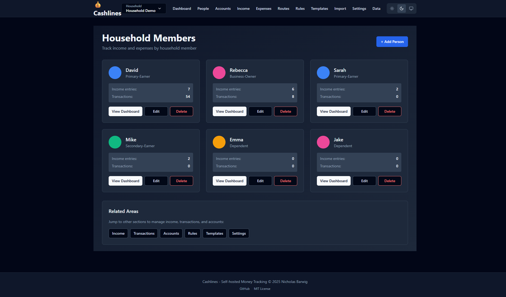
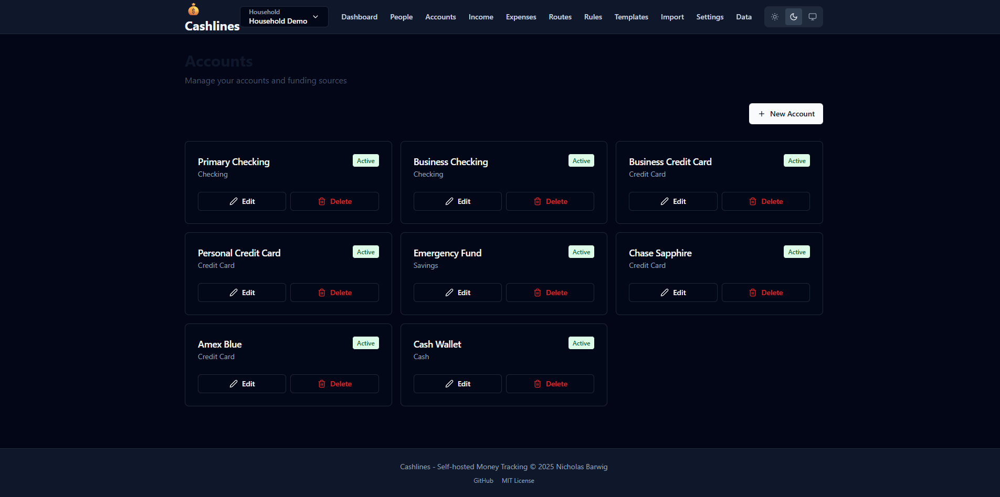
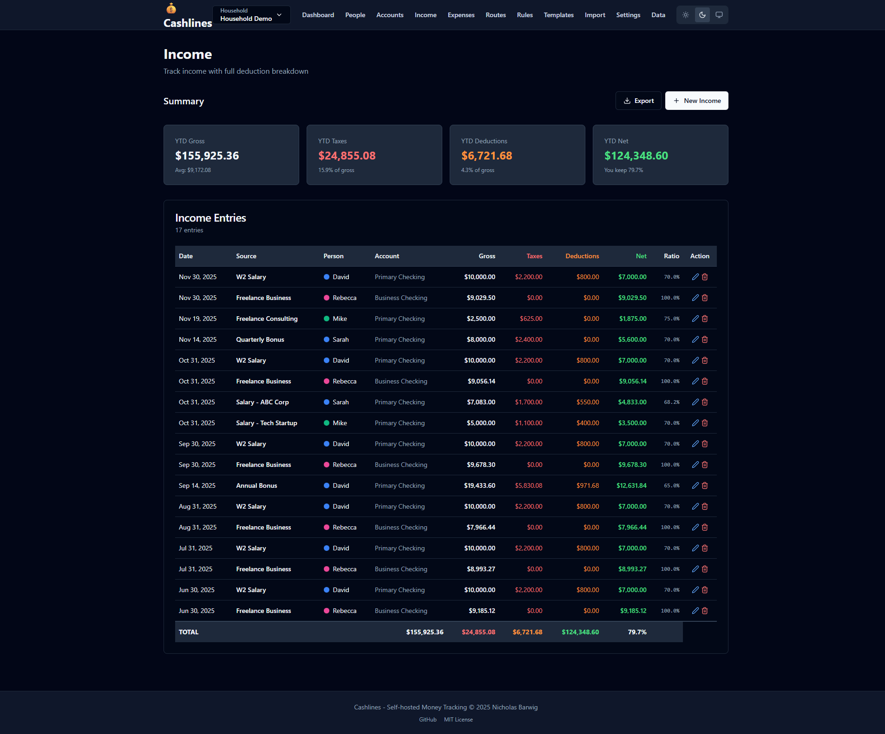

# Cashlines

> Self-hosted personal money tracking. No budgets, no complexity—just tracking where your money comes from and where it goes.

**Purpose**: Understand your money flow. Track income from multiple sources, split expenses across categories (Need/Want/Debt/Tax/Savings), create routing rules for automation, and analyze monthly reports—all privately on your own hardware.

[](https://github.com/nicksbar/cashlines/actions/workflows/test.yml) [](#) [](#license)

## Features

- **Dashboard** - Monthly income, expenses, and money routing overview
- **Expenses** - Track spending with flexible split allocation across categories
- **Recurring Expenses** - Forecast fixed bills and quickly log payments with quick-entry
- **Income Tracking** - Record income with automatic tax and deduction calculations
- **Accounts** - Manage multiple accounts (checking, savings, credit card, cash, custom)
- **Money Routing** - Auto-split money across Need/Want/Debt/Tax/Savings
- **Routing Rules** - Create rules to automatically allocate transactions by pattern
- **Templates** - Save and reuse common entry patterns for quick creation
- **Reports** - Monthly summaries with spending breakdowns
- **Theme Support** - Light/dark/auto themes with persistent preferences
- **Self-Hosted** - Full privacy and control, no external services or tracking

## Screenshots

### Dashboard - Monthly Overview


### Expenses - Track Spending


### Quick Entry - Log Recurring Bills in Seconds


### Recurring Expenses - Manage Bills


### Money Routes - Visualize Allocation


## Quick Start

### Local Development

```bash
git clone https://github.com/nicksbar/cashlines.git
cd cashlines
npm install
cp .env.example .env
npx prisma db push
npm run dev
```

Open [http://localhost:3000](http://localhost:3000)

**First steps:**
1. Create an account (checking, savings, credit card, etc.)
2. Add your monthly income
3. Add credit card statement as a single transaction
4. Split the transaction across spending categories
5. Watch the patterns emerge

### Docker

```bash
docker-compose up -d
```

App runs at [http://localhost:3000](http://localhost:3000) with persistent data volume.

## Tech Stack

**Frontend**: Next.js 14+ (App Router), React 18, TypeScript, Tailwind CSS, shadcn/ui  
**Backend**: Next.js API Routes, TypeScript  
**Database**: Prisma ORM with SQLite (dev) or PostgreSQL (prod)  
**Validation**: Zod schemas  
**Containerization**: Docker & Docker Compose

## Project Structure

```
/src
  /app              - Next.js pages and API routes
    /api            - RESTful endpoints (accounts, income, transactions, rules, templates, reports)
    /accounts       - Account management page
    /income         - Income tracking
    /transactions   - Transaction tracking
    /routes         - Money routing visualization
    /rules          - Routing rules management
    /templates      - Template management
    /import         - Data import
  /components       - React components
  /lib              - Utilities (db, validation, money, date, templates)
/prisma
  schema.prisma     - Database schema
  migrations/       - Database migrations
```

## Why Cashlines?

Traditional budgets fail. They provide constraints that break immediately under real-world pressure, creating nothing but friction.

**Cashlines flips the script**: Instead of budgeting, it provides visibility. You'll understand:
- Where your income actually goes
- Your spending allocation ratios
- Trends that reveal real patterns
- Which spending habits matter most to you

This data-driven approach transforms how you make financial decisions—replacing failed budget cycles with honest awareness.

[**Learn more about the philosophy →**](./docs/ABOUT.md)

## How to Use Cashlines (The Right Way)

**Cashlines is NOT a transaction logger.** Don't track every coffee purchase or small expense—that's the road to burnout and useless data.

### ✅ The Recommended Approach: Credit Card + Income

**Track at the statement level, not the line-item level:**

1. **Record income** as it arrives (salary, side gigs, transfers)
2. **Record credit card statements** as a single transaction (e.g., "$1,247 to Amex")
   - The CC statement shows you what was actually spent last month
   - Split it across Need/Want/Debt/Savings based on your habits
3. **Record direct expenses** for things not on credit cards (rent, groceries if cash, etc.)
4. **Watch the monthly cycle**:
   - Month 1: Income comes in → split and allocate
   - Month 2: CC statement arrives → you see what was actually spent
   - The CC payment closes the loop: income spent = next month's CC bill

**Why this works:**
- You track the full income picture
- You see actual spending via CC statements (not guesses)
- The CC payment next month validates your spending data
- Minimal data entry (statement-level, not line-item)
- No guilt tracking every small purchase

### ✅ If You Don't Have a Credit Card

You can still use Cashlines effectively:

1. **Record income** as received
2. **Record major expenses** (rent, utilities, groceries, etc.)
3. **Categorize with splitting** to see allocation patterns
4. **Review monthly** to understand your spending trends

You'll see spending ratios and patterns, just without the CC statement validation.

### ❌ Don't Do This

- **Don't** track every individual transaction (coffee, gas station, etc.)
- **Don't** aim for 100% expense tracking accuracy
- **Don't** use it like a traditional expense ledger
- **Don't** categorize line items by store name ("Walmart", "Starbucks", "Target")

If you're tempted to do the above, you're using the wrong tool. Cashlines isn't for that.

## Documentation

Complete docs in `/docs/`:

- **[About the Author](./docs/ABOUT.md)** - Why this exists
- **[Getting Started](./docs/GETTING_STARTED.md)** - Setup instructions
- **[Features & Usage](./docs/FEATURES.md)** - How to use each feature
- **[API Reference](./docs/API.md)** - Complete endpoint documentation
- **[Deployment](./docs/DEPLOYMENT.md)** - Docker, LXC, production setups
- **[Agent Instructions](./AGENTS.md)** - Development guidelines

## Status

✅ **MVP complete**: 8 features fully implemented  
✅ **318 tests passing** (100% success rate)  
✅ **Production-ready**: Builds successfully with zero errors  
✅ **Dark mode**: Full light/dark/auto theme support  
✅ **Self-hosted**: Docker and LXC deployment ready

## Privacy & Security

- **Self-Hosted**: Run on your own hardware
- **No Cloud**: No data sent to external services
- **No Tracking**: No analytics, telemetry, or ads
- **Open Source**: Inspect the code yourself
- **Your Data**: Full control and ownership

## License

[MIT License](./LICENSE) - Use freely for personal or commercial use, modify, fork, and distribute. Just keep the copyright notice.

---

**Track your money. Take control. No budgets, no complexity.**
